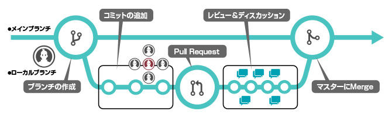

# Contribution Guide

開発作業の精度が人によってまちまちになるのを防ぐための指針です

## Table of Contents

- [開発アイテム/不具合管理](#開発アイテム不具合管理)
- [変更(Pull Request)の作成](#変更pull-requestの作成)
- [Testの作成](#testの作成)
- [コミットメッセージ規約](#コミットメッセージ規約)

## 開発アイテム/不具合管理

[KWIC wiki-プロジェクト運用方針](https://redmule.kyocera.co.jp/redmine/projects/projects/wiki/%E3%83%97%E3%83%AD%E3%82%B8%E3%82%A7%E3%82%AF%E3%83%88%E9%81%8B%E7%94%A8%E6%96%B9%E9%87%9D)に従って開発アイテム/不具合を登録してください

## 変更(Pull Request)の作成

1. 変更に紐づくチケット作成を完了しておきます([開発アイテム不具合管理](#開発アイテム不具合管理)参照)
1. 作業用ブランチを作成します
1. 作業用ブランチ上で変更コミットを作成します
1. Pull Requestを作成します(動作確認完了前はDraft Pull Requestにします)
1. Commit履歴の可読性をあげるため、誤字脱字修正のcommitは極力rebaseでsquashかfixupをします
1. Review完了したらメインブランチにMergeします

[^1]

[^1]: <https://www.macnica.co.jp/business/dx/manufacturers/github/reason.html>

## Testの作成

- [GitHub Actions](https://docs.github.com/actions)を用いたTestの自動実行を強く推奨します
- Pull Requestを契機のTest自動化により、品質やレビューの生産性が向上します
- メインブランチのMergeにはTestのPASSが必須です。 過不足ない適切なレベルのTestを設定してください

## コミットメッセージ規約

[AngularのGit Commit Guidelines](https://github.com/conventional-changelog/conventional-changelog/blob/master/packages/conventional-changelog-angular/README.md)をベースとしています。

以下のような形で記載します

- 1行目に概要
- 2行目は空行
- 3行目から本文
- 3行目以降にリンク

```text
feat(ngInclude): add template url parameter to events

The `src` (i.e. the url of the template to load) is now provided to the
`$includeContentRequested`, `$includeContentLoaded` and `$includeContentError`
events.

Refs: RM-122345
```

```text
                         scope        commit title

        commit type       /                /      
                \        |                |
                 feat(ngInclude): add template url parameter to events

        body ->  The 'src` (i.e. the url of the template to load) is now provided to the
                 `$includeContentRequested`, `$includeContentLoaded` and `$includeContentError`
                 events.

 referenced  ->  Refs: RM-122345
 issues
```

`commit type` としては次のようなものがあります。

- feat
  - 新しい機能の追加など
- fix
  - 既存機能の不具合修正など
- chore
  - 開発補助ツールやライブラリ等の機能外の修正など
- refactor
  - 機能追加やバグの修正に該当しない修正など
- test
  - テストの追加や修正など

`commit type`は、迷ったらとりあえず`fix`と書きます。
`scope`も省略して問題ないので以下のような形でも問題ありません。

```text
fix: コミットメッセージ
```
